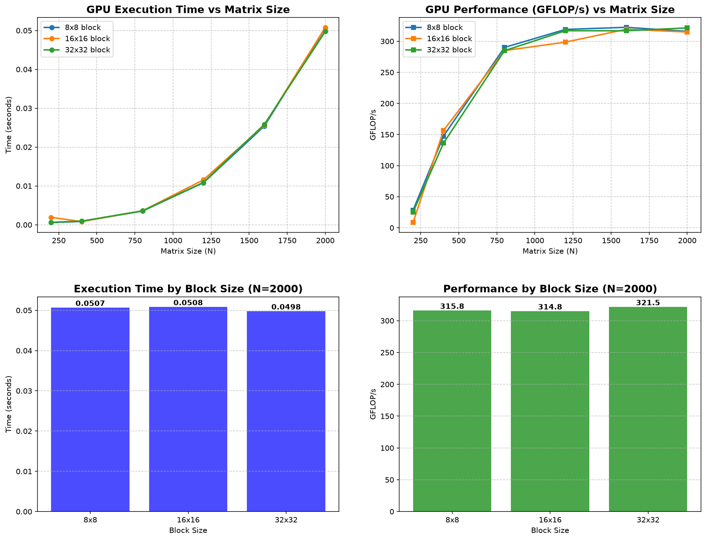

# Лабораторная работа №1. Последовательное умножение квадратных матриц

## 1. Описание алгоритма

### 1.1 Порядок обхода i-k-j

Стандартный алгоритм умножения матриц C = A × B выглядит следующим образом:

```
C[i][j] = Σ(k=0..N-1) A[i][k] * B[k][j]
```

В данной реализации используется оптимизированный порядок циклов **i-k-j**:

```cpp
for (int i = 0; i < n; ++i) {
    for (int k = 0; k < n; ++k) {
        double a_ik = A[i * n + k];
        for (int j = 0; j < n; ++j) {
            C[i * n + j] += a_ik * B[k * n + j];
        }
    }
}
```

**Особенности и преимущества i-k-j**:

* Внутренний цикл по `j` обращается к элементам `B[k][j]` и `C[i][j]` последовательно в памяти, что обеспечивает высокую эффективность работы процессорного кэша.
* Значение `A[i][k]` вынесено во временную переменную, что исключает лишние обращения к памяти.
* Несмотря на оптимизацию, при достижении больших значений N матрицы перестают помещаться в кэш-память, что ведет к падению производительности.

### 1.2 Хранение матриц

Матрицы хранятся в виде одномерных массивов `(std::vector)` с линейной индексацией `[i * n + j]`. Это гарантирует непрерывность блока памяти, что критически важно для производительности.

### 1.3 Вычислительная сложность

* **Количество математических операций**: **2N³** (N³ умножений и N³ сложений).
* **Сложность по памяти**: **3N²** элементов типа `double` (каждый по 8 байт).

## 2. Структура проекта

```text
project/
├── matrix_mult.cpp        - Исходный код умножения матриц (C++)
├── generate_matrices.py   - Скрипт генерации случайных матриц
├── verify.py              - Скрипт верификации результата через NumPy
├── plot_results.py        - Скрипт построения графиков
├── experiment_results.csv - Таблица с результатами замеров
├── run.bat                - Запуск тестового прогона (N=400) + верификация
├── run_all.bat            - Запуск полной серии экспериментов (200..2000)
├── data/                  - Директория с матрицами и графиками
│   └── full_results_plot.png - Сводный график результатов
└── README.md              - Данный отчет
```

## 3. Верификация

Корректность вычислений проверяется с помощью скрипта verify.py:
1. Считываются сгенерированные матрицы A и B, а также матрица C, полученная из C++ программы.
2. Вычисляется эталонное произведение `C_ref = A @ B` с использованием библиотеки NumPy.
3. Производится поэлементное сравнение матриц.

**Все эксперименты успешно прошли верификацию. Ошибок не выявлено.** ✅

## 4. Результаты экспериментов

### 4.1 Конфигурация стенда

* **Процессор**: 12th Gen Intel(R) Core(TM) i5-1240P
* **ОС**: Windows 11
* **Компилятор**: g++ (флаг `-O2`)
* **Тип данных**: `double` (64 бит)
* **Режим выполнения**: однопоточный

### 4.2 Таблица результатов

| N | Время (сек) | Объём (GFLOP) | Произв. (GFLOP/s) | Память (МБ) |
| :--- | :--- | :--- | :--- | :--- |
| 200  | 0.0015      | 0.016         | 10.86             | 0.92        |
| 400  | 0.0167      | 0.128         | 7.68              | 3.66        |
| 800  | 0.5126      | 1.024         | 2.00              | 14.65       |
| 1200 | 1.4077      | 3.456         | 2.46              | 32.96       |
| 1600 | 5.6924      | 8.192         | 1.44              | 58.59       |
| 2000 | 11.3237     | 16.000        | 1.41              | 91.55       |

### 4.3 Графики



## 5. Анализ результатов

### 5.1 Временная сложность

Экспериментальные данные полностью подтверждают теоретическую асимптотическую сложность алгоритма **O(N³)**. На совмещенном графике видно, что кривая фактического времени выполнения совпадает с теоретической кривой кубической параболы.

### 5.2 Производительность и влияние кэш-памяти

График производительности (GFLOP/s) наглядно демонстрирует влияние иерархии памяти:
1. **Пик производительности**: Достигается при размерах матриц около N=400 - N=800. В этом диапазоне общий объем памяти позволяет матрицам целиком размещаться в кэш-памяти процессора.
2. **Падение производительности**: При N=1200 и выше матрицы перестают помещаться в кэш. Начинает происходить вытеснение строк кэша. Процессору приходится постоянно обращаться к медленной оперативной памяти, из-за чего производительность неуклонно снижается.

## 6. Выводы

1. Разработана и успешно протестирована программа для однопоточного перемножения матриц на языке C++.
2. Применение порядка циклов 'i-k-j' позволило достичь оптимального последовательного доступа к памяти.
3. Экспериментально подтверждена кубическая сложность алгоритма.
4. Выявлено узкое место: при увеличении объема данных скорость вычислений ограничивается пропускной способностью подсистемы памяти. В будущих работах это будет решаться распараллеливанием.

## 7. Инструкция по запуску

Для выполнения полной серии экспериментов с генерацией графиков:

```cmd
run_all.bat
```

Для одиночного запуска с верификацией:
```cmd
run.bat
```

**Требования для запуска**:

* g++ (MinGW-w64)
* Python 3 + `numpy` + `matplotlib`