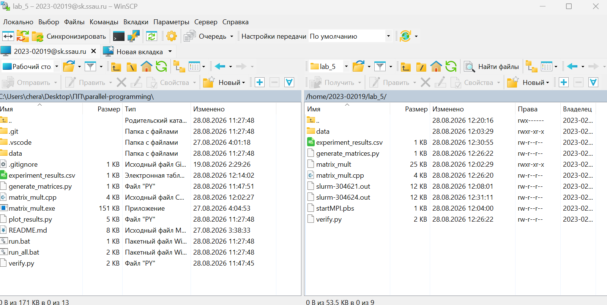
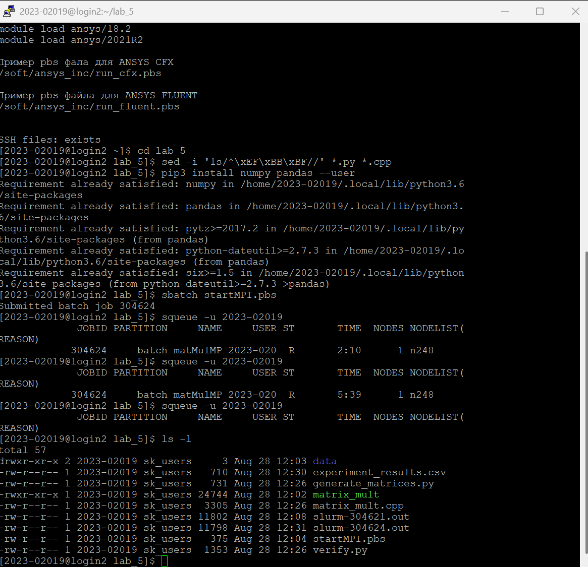
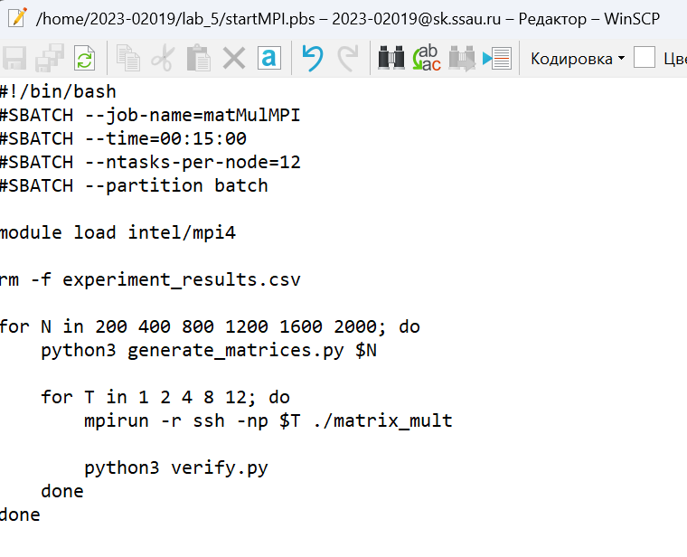

# Лабораторная работа №5. Запуск MPI-программы на вычислительном кластере

## 1. Описание алгоритма

### 1.1 Распараллеливание с помощью MPI и порядок обхода i-k-j

В отличие от последовательной реализации, технология **MPI (Message Passing Interface)** использует модель распределенной памяти (Distributed Memory). Запускаются изолированные процессы, которые обмениваются данными посредством явной передачи сообщений.

В данной работе реализована топология **"Начальник - Подчиненные" (Master-Worker)**:
1. Процесс с рангом `0` считывает исходные матрицы $A$ и $B$ из файлов.
2. Матрица B рассылается всем процессам целиком с помощью функции `MPI_Bcast`.
3. Матрица A разрезается на горизонтальные полосы и распределяется между процессами функцией `MPI_Scatterv`.
4. Каждый процесс выполняет перемножение своей локальной части A на матрицу B.
5. Локальные матрицы C отправляются обратно нулевому процессу и склеиваются с помощью `MPI_Gatherv`.

Внутри локальных вычислений каждого процесса сохранен оптимизированный порядок обхода циклов **i-k-j**:
```cpp
for (int i = 0; i < local_rows; ++i) {
    for (int k = 0; k < n; ++k) {
        double a_ik = local_A[i * n + k];
        for (int j = 0; j < n; ++j) {
            local_C[i * n + j] += a_ik * B[k * n + j];
        }
    }
}
```

### 1.2 Хранение матриц

Все матрицы (как локальные куски, так и полные копии) хранятся в виде одномерных массивов '(std::vector)' с линейной индексацией '[i * n + j]'. Для MPI непрерывность блока памяти критически важна: функции пересылки данных могут работать только с единым непрерывным участком памяти.

### 1.3 Вычислительная сложность

* **Количество математических операций**: **2N³** (N³ операций умножения и N³ сложения, распределенных поровну между процессами).
* **Сложность по памяти**: **(T + 2) × N²** элементов типа 'double'. Ввиду распределенной памяти, матрица B дублируется T раз.

## 2. Структура проекта

```text
project/
├── matrix_mult.cpp        - Исходный код умножения матриц (C++ с MPI)
├── generate_matrices.py   - Скрипт генерации случайных матриц
├── verify.py              - Скрипт верификации результата через NumPy
├── plot_results.py        - Скрипт построения графиков
├── experiment_results.csv - Таблица с результатами замеров
├── startMPI.pbs           - SLURM-скрипт для запуска задачи в очередь
├── data/                  - Директория с матрицами, графиками и скриншотами
│   ├── approve.png        - Скриншот передачи файлов
│   ├── terminal_1.png     - Скриншот настройки окружения
│   ├── startMPI.png       - Скриншот конфигурации пакетного файла
│   └── full_results_plot.png - Сводный график результатов
└── README.md              - Данный отчет
```

## 3. Порядок работы на суперкомпьютере

Вычисления производились на базе суперкомпьютера «Сергей Королев» (СГАУ).

### 3.1 Передача исходных файлов и подготовка окружения

1. Произведено подключение к главному узлу кластера по протоколу SSH через терминал PuTTY.

2. Осуществлено подключение через WinSCP для копирования исходных файлов .cpp и .py с локального ПК в рабочую директорию суперкомпьютера.


3. В терминале произведена очистка исходных кодов от скрытых символов Windows (BOM), препятствующих работе компилятора в Linux: sed -i '1s/^\xEF\xBB\xBF//' *.py *.cpp.

4. Установлены требуемые для генерации и верификации Python-библиотеки: pip3 install numpy pandas --user.

5. Выполнена предварительная компиляция C++ кода. Для этого загружен модуль Intel MPI, назначена системная переменная компилятора и вызвана команда сборки: mpicxx matrix_mult.cpp -o matrix_mult -O2.



### 3.2 Формирование и запуск SLURM-скрипта

Для автоматизированного прогона экспериментов использован менеджер очередей SLURM.
Скрипт 'startMPI.pbs' содержит директивы планировщика (имя задачи, время выполнения 15 минут, запрос на 12 ядер, раздел batch) и вложенные циклы для последовательного запуска с разными размерами матриц и числом потоков.



Задача отправлена в очередь вычислительных узлов командой 'sbatch startMPI.pbs'.

## 4. Верификация

Корректность вычислений проверяется с помощью скрипта verify.py:
1. Считываются сгенерированные матрицы A и B, а также матрица C, полученная из C++ программы.
2. Вычисляется эталонное произведение 'C_ref = A @ B' с использованием библиотеки NumPy.
3. Производится поэлементное сравнение матриц.
**Все эксперименты успешно прошли верификацию. Ошибок не выявлено.** ✅

## 5. Результаты экспериментов

### 5.1 Конфигурация стенда

В соответствии со спецификацией кластера «Сергей Королев», вычисления производятся на блейд-серверах платформы IBM BladeCenter:

* **Вычислительные узлы**: 2x Intel Xeon E5-2665 (8C, 2.40GHz) / Intel Xeon E5-2680v2 / Intel Gold 6230.
* **Системная сеть**: QLogic/Voltaire InfiniBand DDR/QDR (40 Гбит/с).
* **ОС**: Linux.
* **Реализация MPI**: Intel MPI 4.

### 5.2 Таблица результатов

| Размер (N) | Процессы | Время (сек) | Произв. (GFLOP/s) |
| :--- | :--- | :--- | :--- |
| **200**  | 1  | 0.00857 | 1.86  |
| 200      | 2  | 0.00435 | 3.67  |
| 200      | 4  | 0.00222 | 7.19  |
| 200      | 8  | 0.00135 | 11.80 |
| 200      | 12 | 0.00087 | 18.22 |
| **400**  | 1  | 0.06796 | 1.88  |
| 400      | 2  | 0.03413 | 3.75  |
| 400      | 4  | 0.01734 | 7.38  |
| 400      | 8  | 0.00887 | 14.42 |
| 400      | 12 | 0.00639 | 20.01 |
| **800**  | 1  | 0.54272 | 1.88  |
| 800      | 2  | 0.27309 | 3.74  |
| 800      | 4  | 0.13865 | 7.38  |
| 800      | 8  | 0.11230 | 9.11  |
| 800      | 12 | 0.11271 | 9.08  |
| **1200** | 1  | 1.87825 | 1.84  |
| 1200     | 2  | 0.95106 | 3.63  |
| 1200     | 4  | 0.56038 | 6.16  |
| 1200     | 8  | 0.39849 | 8.67  |
| 1200     | 12 | 0.38011 | 9.09  |
| **1600** | 1  | 4.76697 | 1.71  |
| 1600     | 2  | 2.50207 | 3.27  |
| 1600     | 4  | 1.32130 | 6.19  |
| 1600     | 8  | 0.93842 | 8.72  |
| 1600     | 12 | 0.89592 | 9.14  |
| **2000** | 1  | 9.14432 | 1.74  |
| 2000     | 2  | 4.68986 | 3.41  |
| 2000     | 4  | 2.66987 | 5.99  |
| 2000     | 8  | 1.83819 | 8.70  |
| 2000     | 12 | 1.75629 | 9.11  |

### 5.3 Графики


## 6. Анализ результатов

### 6.1 Временная сложность

Полученные экспериментальные данные полностью подтверждают теоретическую асимптотическую сложность алгоритма **O(N^3)**. На графике времени выполнения (Execution Time) отчетливо видно, что для любой конфигурации запущенных процессов кривая представляет собой классическую кубическую параболу. 

С увеличением числа MPI-процессов абсолютное время расчетов предсказуемо снижается (например, для N=2000 время упало с 9.14 сек на 1 процессе до 1.75 сек на 12 процессах), однако сам характер кубического роста времени от объема задачи сохраняется неизменным.

### 6.2 Производительность и влияние кэш-памяти

График производительности (GFLOP/s) наглядно демонстрирует влияние иерархии памяти серверных процессоров и внутриузловой шины:

1. **Пик производительности**: Наблюдается ярко выраженный максимум на матрицах размера N=400, где достигается скорость около **20.01 GFLOP/s** на 12 процессах. В этом диапазоне локальные порции матриц A, B и C идеально помещаются в высокоскоростную кэш-память L2/L3 вычислительных узлов, исключая задержки при обращении к ОЗУ.
2. **Падение производительности (Cache Misses)**: При N >= 800 объемы данных возрастают настолько, что они перестают помещаться в кэш-память процессора. Начинается лавинообразный рост кэш-промахов, из-за чего ядра вынуждены простаивать в ожидании данных из более медленной оперативной памяти. В результате производительность 12 процессов падает более чем в два раза — до ~9 GFLOP/s.
3. **Упор в память (Memory Wall)**: Графики ускорения (Speedup) показывают, что для матрицы N=2000 на 12 процессах реальное ускорение составило лишь **~5.2x** (эффективность упала до ~0.43). Это обусловлено колоссальными накладными расходами функции `MPI_Bcast`, которая вынуждена физически дублировать матрицу B в ОЗУ для каждого процесса, забивая пропускную способность системной шины кластера.

## 7. Выводы

1. Исходный код C++ с использованием MPI продемонстрировал полную кроссплатформенность: программа успешно скомпилирована и выполнена в среде Linux на суперкомпьютере «Сергей Королёв» без внесения изменений.
2. Экспериментально доказана кубическая вычислительная сложность алгоритма O(N^3).
3. Выявлено существенное влияние кэш-памяти на скорость расчетов: пиковая производительность достигается только на тех объемах данных, которые способны разместиться во внутренней памяти процессора (в данном случае N=400).
4. Установлено узкое место распределенной модели MPI при работе на единичном узле: пропускная способность памяти и затраты времени на дублирование данных (передача сообщений) сильно ограничивают линейный рост ускорения при увеличении числа процессов.

## 8. Инструкция по запуску

Для автоматизированной отправки пакетной задачи в очередь планировщика SLURM:

```bash
sbatch startMPI.pbs
```

Для проверки статуса задачи в очереди:

```bash
squeue -u <имя_пользователя>
```

**Требования для запуска**:

* intel/mpi4
* Python 3 + `numpy`, `matplotlib`, `pandas`